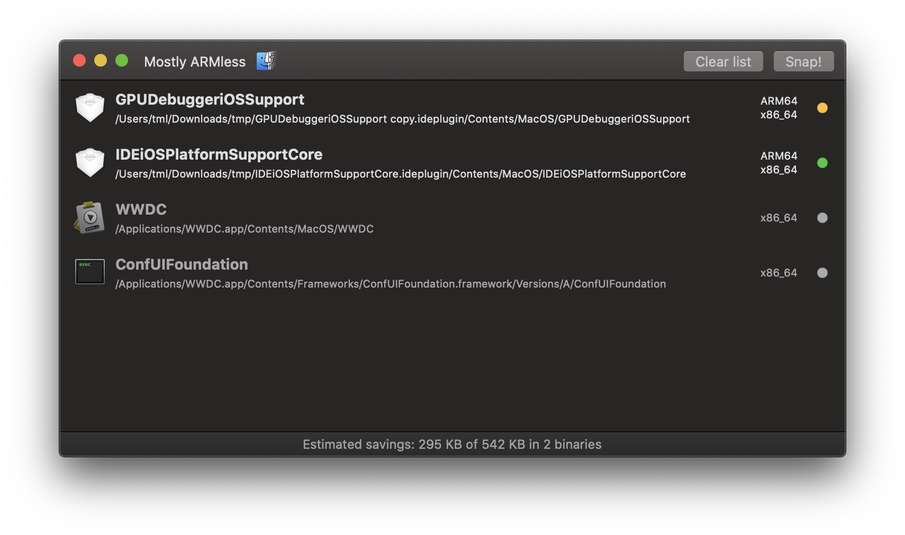

#  Mostly ARMless

Mostly ARMless is a small app to strip foreign architecture parts of universal binaries on macOS.

## Purpose

With the advent of Apple Silicon Macs, arrived yet again the age of universal binaries on macOS which contain both x86_64 and ARM64 executable code. Since apps are typically not copied between machines once installed, there is no need for Intel-specific code on Apple Silicon hardware and vice versa, the unused parts can be removed which results in significant gain in free disk space.

On macOS, the `lipo` tool can perform this binary thinning-- just from the command line. In order to make the process less tedious, _Mostly ARMless_ was born.

## The GUI

_Mostly ARMless_ copies its user interface from the great predecessor [_Xslimmer_](https://xslimmer.com). 

Files and folders can be dragged and dropped onto the main window to scan them for potentially strippable multi-architecture executables (apps, libraries, plugins etc). All the executables found are then added to the list, which shows the identified architectures and writable statuses as well (green - eligible, yellow - eligible with admin permissions, red - read-only volume, gray - not thinnable). The list is updated with each new file/folder drop, together with the estimation for the reclaimed disk space in the status bar. Individual items can be removed by selecting and pressing Backspace, or the whole list can be cleared with the help of the toolbar button.

Binary thinning is started with the Snap! toolbar button. Thinning will be performed on **all eligible items in the list**, regardless of their selection state. 

> ⚠️ Note that the conversion is final and **cannot be undone**, so make sure you have a backup in case something goes wrong.

## Under the hood

_Mostly ARMless_ is just a graphical frontend to `lipo`, so apart from the convenience UI there is really not much else to it. It served for me as a test project to get familiar with SwiftUI.

## Requirements

To build: Xcode 11.7+

To run: macOS Catalina (10.15) and above

## License

MIT